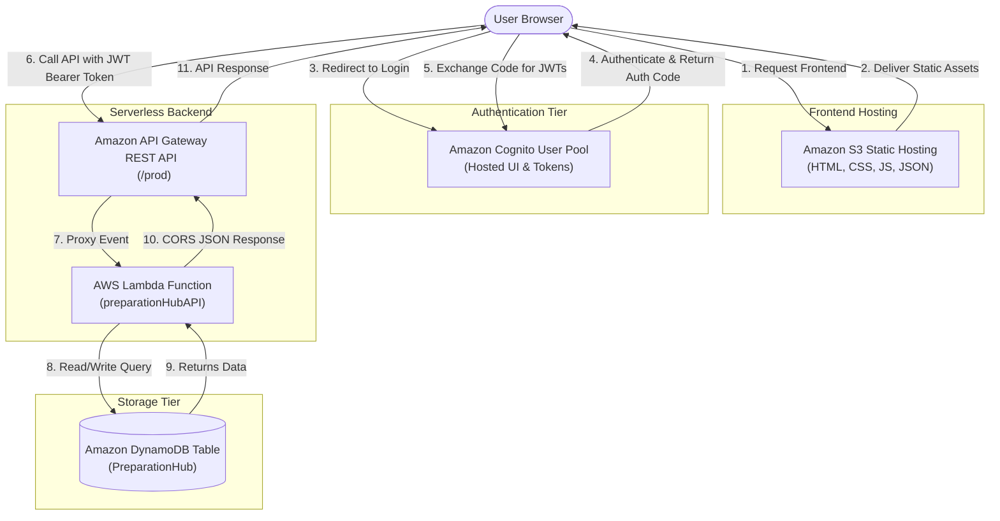
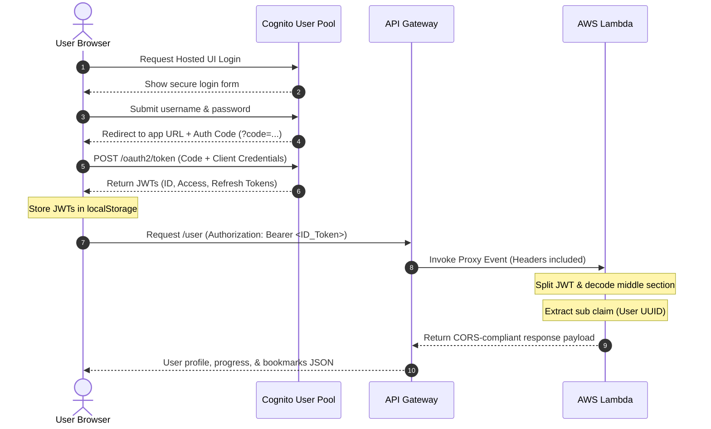

# Preparation Hub (PrepHub) - Technical Architecture & Workflow Document

This technical document provides a comprehensive, professional explanation of the architecture, workflow, and control flow of the **Preparation Hub (PrepHub)** project. It details the serverless architecture, AWS integrations, authentication, database design, and end-to-end user journeys.

---

## 1. Project Overview

### What is Preparation Hub?
**Preparation Hub (PrepHub)** is a modern, responsive, serverless web application designed to help engineering and computer science students prepare for placement examinations, technical interviews, and coding assessments. It provides a structured learning environment with practice questions, mock tests, subject-specific dashboards, and company recruitment patterns.

### Objectives of the Project
- **Centralize Placement Resources:** Consolidate preparation materials for core Computer Science subjects (DBMS, Operating Systems, Computer Networks, Data Structures & Algorithms) and company-specific coding assessments into a single platform.
- **Personalized Tracking:** Monitor and persist each user's progress, mock test performances, and bookmarked questions.
- **Interactive Assistance:** Leverage AI capabilities via a client-side Gemini API integration to offer instant, detailed explanations for mock test answers.
- **Cloud-Native Implementation:** Showcase a robust, low-maintenance, cost-effective serverless architecture utilizing AWS services.

### Problems it Solves
1. **Scattered Study Materials:** Students often jump between websites, YouTube, and PDFs. PrepHub organizes these into clean categories.
2. **Lack of Progress Persistence:** Many static tutorial websites do not save what questions the student has solved or bookmarked. PrepHub tracks state across multiple devices.
3. **High Maintenance & Infrastructure Costs:** Traditional web apps require 24/7 server hosting (e.g., VPS), incurring fixed costs. PrepHub uses pay-as-you-go AWS serverless resources, reducing hosting costs to near zero for small-to-medium deployments.
4. **Static Explanations:** When a student gets a question wrong in a mock test, standard platforms offer static solutions. PrepHub integrates Gemini AI to provide interactive, dynamic explanations.

### Target Users
- **College Students:** Preparing for campus recruitment drives.
- **Job Seekers:** Brush-up on CS fundamentals and company-specific trends.
- **Educators/Mentors:** Directing students to a structured placement roadmap.

---

## 2. Overall System Architecture

PrepHub is built using a **serverless, decoupled, three-tier architecture**:
1. **Presentation Tier (Frontend):** Static HTML5, Vanilla CSS3, and JavaScript hosted on **Amazon S3** (or Vercel CDN), providing responsive, fast-loading user interfaces.
2. **Logic Tier (API & Compute):** Managed **Amazon API Gateway** endpoint acting as an entry router and traffic manager, forwarding requests to serverless **AWS Lambda** functions running Node.js runtime environment.
3. **Data Tier (Storage & Identity):** **Amazon Cognito User Pools** managing authentication and OAuth 2.0 flows, and **Amazon DynamoDB** acting as the NoSQL database storing user profiles, bookmarks, and subject progress.

### Architecture Diagram



---

## 3. Complete Control Flow

The table below outlines the step-by-step lifecycle of a user session, explaining the AWS service involved, why it is necessary, and the failure state if that service was omitted.

| Step | Operation | AWS Service involved | Why is it required? | What if it did not exist? |
| :--- | :--- | :--- | :--- | :--- |
| **1** | **Loading the Site:** User inputs URL. The static assets (HTML, CSS, JS, images, questions registry) are served. | **Amazon S3** / CDN | Hosts and distributes public static assets globally with low latency. | Traditional web server (e.g. Nginx on EC2) required, increasing hosting cost and administrative upkeep. |
| **2** | **DNS Lookup:** Resolving project URL to hosting servers. | **Amazon Route 53** (Optional) | Maps user-friendly DNS records to hosting IP endpoints. | Users would have to connect via raw IP addresses or default AWS endpoints. |
| **3** | **Initiating Login:** User clicks the login button; browser redirects to authentication UI. | **Amazon Cognito (Hosted UI)** | Provides pre-built, secure login, signup, and validation pages. | Developers must build, secure, and host authorization forms, handling encryption and session security from scratch. |
| **4** | **Credential Validation:** User authenticates. Cognito issues an authorization code and redirects to the application's callback URL. | **Amazon Cognito (User Pool)** | Validates user password hashes, handles MFA, checks lockout constraints, and signs redirect codes. | Compromises security. Requires custom user accounts database, password hashing algorithms, and session trackers. |
| **5** | **Token Exchange:** Frontend captures the auth code in URL and exchanges it for JSON Web Tokens (JWTs). | **Amazon Cognito (Token Endpoint)** | Validates the authorization code and outputs standards-compliant ID, Access, and Refresh tokens. | Unable to implement stateless OAuth 2.0 verification. Security vulnerabilities increase. |
| **6** | **Session Setup:** Browser saves tokens in local memory, decodes email from ID token, and directs user to `dashboard.html`. | Browser `localStorage` | Maintains active authentication state on client without re-requesting credentials. | User logs out on every page reload or navigation step. |
| **7** | **API Call Trigger:** Frontend requests saved profile, bookmarks, and progress data by making HTTP requests. | **Amazon API Gateway** | Provides a secure, HTTPS endpoint URL exposed to the web. | Lambda functions cannot receive direct public web traffic without a gateway proxy or load balancer. |
| **8** | **CORS & Proxying:** API Gateway intercepting request, validation, and forwarding JSON payload to computing layer. | **Amazon API Gateway** | Manages browser CORS preflight requests (OPTIONS) and converts HTTP headers/body into a Lambda event. | Browsers block API requests due to CORS policies. API Routing code must be handled manually. |
| **9** | **Computing Logic:** Lambda function initiates, parses request header token, and routes to appropriate execution handler. | **AWS Lambda (`preparationHubAPI`)** | Executes backend application code on-demand without provisioned servers. | Always-on virtual machines required, causing idle billing and configuration complexities. |
| **10** | **Identity Decryption:** Backend decodes the user's Cognito unique ID (`sub` claim) from the ID token. | **AWS Lambda** | Resolves user identity securely in the backend, preventing client impersonation. | Vulnerability: Users could fetch data of other users by sending spoofed parameters. |
| **11** | **Database Retrieval:** Backend queries database using Cognito `sub` as the partition key. | **Amazon DynamoDB** | Stores user configuration records in structured partitions with millisecond response time. | Storing data locally on client prevents syncing across devices; using relational SQL requires database clustering. |
| **12** | **Formatting & Delivery:** Lambda constructs a CORS-compliant API response and returns it via API Gateway. | **AWS Lambda / API Gateway** | Returns JSON response alongside Access-Control headers back to the browser client. | Frontend fails to map user bookmarks and progress. |
| **13** | **State Updates (Bookmarks/Progress):** User interacts with questions. Changes synchronize with backend via POST endpoints. | **API Gateway / Lambda / DynamoDB** | Updates user partitions in DynamoDB using PutItem operations to keep cloud and client states aligned. | Progress is lost when browser cache is cleared. |
| **14** | **Logging Out:** User logs out. Frontend clears localStorage tokens and redirects to dashboard. | Browser / Client | Erases local authentication cache so subsequent users on the machine cannot hijack the session. | Security breach: Session remains open indefinitely. |

---

## 4. AWS Services Used

This section contains a deep dive into each AWS and CI/CD component utilized in the project.

---

### Amazon S3 (Simple Storage Service)

#### Introduction & Purpose
Amazon S3 is an object storage service offering industry-leading scalability, data availability, security, and performance. In PrepHub, S3 acts as the **static web hosting platform**, serving HTML, CSS, JavaScript, static JSON assets, and images to the client browser.

#### Features
- **Static Website Hosting:** Allows serving web pages directly from an S3 bucket without web servers.
- **99.999999999% Durability:** Spans objects across multiple availability zones.
- **Granular IAM and Bucket Policies:** Restricts access to public-read while allowing write permissions to deployment scripts.

#### Why We Selected It
S3 is extremely cost-effective for static frontend sites. It eliminates the need to provision, manage, or scale EC2 web servers. It integrates seamlessly with CDNs (like Amazon CloudFront or Vercel).

#### How it Works Internally
S3 manages data as "objects" inside "buckets." Objects consist of key-value pairs (the key is the filepath, the value is the binary/text file content) alongside custom metadata. When configured for static hosting, S3 routes request URLs (e.g. `/dashboard.html`) to the index document.

#### How it Integrates with the Project
All static files (`index.html`, `/js`, `/css`, `/data/registry.json`) are stored inside the S3 bucket. The site can be loaded directly through the bucket's website endpoint (e.g., `http://<bucket-name>.s3-website-us-east-1.amazonaws.com`).

#### Advantages
- Near-zero maintenance.
- Scale-to-infinity performance.
- Direct integration with build pipelines.

#### Limitations
- Supports static assets only. No dynamic server-side runtimes (like PHP, JSP, or Node.js SSR).

#### Real-World Example
Netflix hosts their static web page assets, UI templates, and streaming video chunks on Amazon S3.

#### Best Practices
- Place a CloudFront CDN in front of S3 to enable HTTPS and cache assets globally.
- Keep the S3 bucket private, utilizing an Origin Access Control (OAC) policy for CloudFront access.

---

### Amazon Cognito

#### Introduction & Purpose
Amazon Cognito provides customer identity and access management (CIAM) that scales to millions of users. It manages user signup, signin, Hosted UI logins, password resets, and session tokens.

#### Features
- **User Pools:** Managed directories that handle registration, authentication, and token generation.
- **Hosted UI:** Out-of-the-box responsive login/registration web screens.
- **Federated Identity:** Logins via Google, Apple, Facebook, or SAML (if configured).

#### Why We Selected It
It allows PrepHub to bypass the risky and complex process of managing user passwords, hashes, MFA, and OAuth 2.0 flows manually, shifting security risks to AWS.

#### How it Works Internally
Cognito acts as an Identity Provider (IdP) supporting OAuth 2.0/OIDC. Users input credentials into Cognito. Cognito validates them and issues cryptographically signed JSON Web Tokens (JWTs) including an ID Token, Access Token, and Refresh Token.

#### How it Integrates with the Project
Configuration resides in [js/utils.js](file:///w:/AWS-2/js/utils.js#L5-L15):
```javascript
const COGNITO_CONFIG = {
    region: 'us-east-1',
    userPoolId: 'us-east-1_djAcEVxhN',
    clientId: '6ad3gtr20eelnje7mp8ooilu6u',
    hostedUiUrl: 'https://us-east-1djacevxhn.auth.us-east-1.amazoncognito.com/login?client_id=6ad3gtr20eelnje7mp8ooilu6u...',
    redirectUri: 'https://prep-hub-gamma.vercel.app/',
    domain: 'https://us-east-1djacevxhn.auth.us-east-1.amazoncognito.com'
};
```
The application calls `window.loginUser()` to redirect the user to the Hosted UI and catches the resulting OAuth code on reload via `exchangeCodeForTokens(code)`.

#### Advantages
- Built-in security policies (MFA, password complexity rules, compromised credential checks).
- Standardized OAuth 2.0 endpoints.

#### Limitations
- Hosted UI styles are somewhat difficult to heavily customize compared to standard HTML elements.

#### Real-World Example
Enterprise SaaS platforms utilize Cognito to manage multi-tenant user access securely.

#### Best Practices
- Always enforce MFA (Multi-Factor Authentication).
- Use Cognito User Pool triggers (Lambda functions) for custom signup validations.

---

### Amazon API Gateway

#### Introduction & Purpose
Amazon API Gateway is a fully managed service that makes it easy for developers to create, publish, maintain, monitor, and secure REST and HTTP APIs at any scale. It acts as the secure entry gate for all backend requests.

#### Features
- **CORS Handling:** Enforces Cross-Origin Resource Sharing settings directly.
- **Lambda Proxy Integration:** Forwards complete client request events to Lambda, returning execution outputs directly back to the client.
- **Gateway Responses:** Customize error responses and add CORS headers for 4xx/5xx failures.

#### Why We Selected It
It bridges HTTP requests from the browser to serverless Lambda scripts. It scales automatically and handles routing, SSL termination, and CORS without manual configuration.

#### How it Works Internally
API Gateway maps incoming HTTP methods and resource paths (e.g. `POST /progress`) to specific backend integrations (Lambda functions). It executes mapping templates, verifies tokens (if using authorizers), and marshals responses.

#### How it Integrates with the Project
Exposes endpoints `/user` (GET), `/bookmark` (POST), `/progress` (POST), and `/profile` (POST). As detailed in [backend/aws_setup.md](file:///w:/AWS-2/backend/aws_setup.md#L68-L111), these are linked to the `preparationHubAPI` Lambda using proxy integrations. Gateway Responses are configured with `Access-Control-Allow-Origin: '*'` headers to prevent CORS errors during authorization failures.

#### Advantages
- Native integration with Cognito and Lambda.
- Built-in throttling to prevent DDOS attacks.

#### Limitations
- Request execution timeout is limited to a maximum of 29 seconds.

#### Real-World Example
E-commerce websites utilize API Gateway to route client API requests to individual microservices (Lambda, ECS) securely.

#### Best Practices
- Enable API Gateway caching for read-heavy routes to reduce database read costs.
- Turn on CloudWatch execution logs for API monitoring and debugging.

---

### AWS Lambda

#### Introduction & Purpose
AWS Lambda is a serverless, event-driven compute service that lets you run code for virtually any type of application or backend service without provisioning or managing servers. It executes PrepHub's core backend routing and data processing.

#### Features
- **Serverless Compute:** Runs on demand; only billed for processing time used (calculated in milliseconds).
- **Auto-Scaling:** Scales dynamically based on the volume of incoming API Gateway requests.
- **Runtime Support:** Native Node.js, Python, Java, Go, and C# runtimes.

#### Why We Selected It
No servers to manage, update, or pay for while idle. It seamlessly queries DynamoDB using AWS SDK v3, which is pre-bundled in the Node.js runtime environment.

#### How it Works Internally
When an API Gateway request hits a resource, AWS Lambda spins up an isolated execution container running the specified runtime environment, loads the function code, and executes the `handler()` function. After execution, the container is suspended or terminated.

#### How it Integrates with the Project
Code is stored in [backend/index.js](file:///w:/AWS-2/backend/index.js). The handler function:
1. Normalizes the request path and method.
2. Extracts the JWT authorization header.
3. Decodes the payload to identify the user's Cognito UUID (`sub`).
4. Invokes corresponding database helpers (`getUserData`, `saveBookmarks`, `saveProgress`, `saveProfile`).

#### Advantages
- Zero administrative overhead.
- Pay-as-you-go down to the millisecond.

#### Limitations
- **Cold Starts:** Initial container spin-up time can cause minor latency (100ms–1s) on sporadic requests.

#### Real-World Example
Financial institutions use Lambda functions to process transaction data asynchronously immediately after transactions occur.

#### Best Practices
- Minimize package size to reduce cold start times.
- Keep database client connections initialized outside the handler function for reuse.

---

### Amazon DynamoDB

#### Introduction & Purpose
Amazon DynamoDB is a fully managed, serverless, key-value and document NoSQL database designed to run high-performance applications at any scale. It acts as the database for all user-specific data in PrepHub.

#### Features
- **Consistent Single-Digit Millisecond Latency:** Performs reads and writes in milliseconds at any scale.
- **NoSQL Schema Flexibility:** Stores JSON structures with arbitrary keys under partition key constraints.
- **On-Demand Capacity Mode:** Charges purely for database operations performed rather than pre-provisioned throughput.

#### Why We Selected It
Matches the serverless nature of the stack. It uses a single-table design that fits the project data model, minimizing cost and setup complexities.

#### How it Works Internally
DynamoDB partitions data across physical storage nodes using the partition key (hash key). The sort key (range key) organizes records within that partition, allowing efficient queries.

#### How it Integrates with the Project
- **Table Name:** `PreparationHub`
- **Partition Key (PK):** `userId` (Cognito `sub` claim)
- **Sort Key (SK):** `dataType` (`PROFILE`, `BOOKMARKS`, `PROGRESS`)
As configured in [backend/index.js](file:///w:/AWS-2/backend/index.js#L87-L198), it uses the `@aws-sdk/lib-dynamodb` document client to perform `QueryCommand` and `PutCommand` operations.

#### Advantages
- High availability with automatic replication across multiple availability zones.
- Single-table design allows fetching all user configuration records in a single query.

#### Limitations
- Maximum size limit of 400KB per single item (including attribute names).
- Complex relationships require careful schema design.

#### Real-World Example
Amazon.com uses DynamoDB to manage shopping carts, session states, and customer checkouts during peak sales events like Prime Day.

#### Best Practices
- Utilize Single-Table design patterns to minimize query counts.
- Enable DynamoDB Backups (Point-in-Time Recovery) to protect against accidental deletions.

---

### GitHub Actions (CI/CD)

#### Introduction & Purpose
GitHub Actions is a continuous integration and continuous delivery (CI/CD) platform that allows you to automate your build, test, and deployment pipeline.

#### Features
- **Workflow Automation:** Trigger actions on code commits, pull requests, or manually.
- **Runner Environments:** Execute steps on hosted Linux, Windows, or macOS containers.
- **Secret Management:** Securely stores AWS credentials (`AWS_ACCESS_KEY_ID`, `AWS_SECRET_ACCESS_KEY`) for deployments.

#### Why We Selected It (Architecture Standard)
Automates the testing and deployment of frontend assets to S3 and updates Lambda backend zip files, reducing deployment steps to a simple `git push`.

#### How it Works Internally
A YAML workflow configuration located in `.github/workflows/deploy.yml` specifies instructions. When a push to the main branch is registered, GitHub runners pull the code, test it, construct a ZIP file for the Lambda code, upload it via AWS CLI, and copy static HTML files to S3.

#### How it Integrates with the Project
A standard deployment workflow configuration:
```yaml
name: Deploy PrepHub Stack

on:
  push:
    branches: [ main ]

jobs:
  deploy:
    runs-on: ubuntu-latest
    steps:
      - name: Checkout Code
        uses: actions/checkout@v3

      - name: Configure AWS Credentials
        uses: aws-actions/configure-aws-credentials@v2
        with:
          aws-access-key-id: ${{ secrets.AWS_ACCESS_KEY_ID }}
          aws-secret-access-key: ${{ secrets.AWS_SECRET_ACCESS_KEY }}
          aws-region: us-east-1

      - name: Deploy Frontend to S3
        run: |
          aws s3 sync . s3://my-prephub-bucket --exclude "backend/*" --exclude ".git/*" --delete

      - name: Deploy Backend Lambda
        run: |
          cd backend
          zip -r lambda.zip index.js package.json
          aws lambda update-function-code --function-name preparationHubAPI --zip-file fileb://lambda.zip
```

#### Advantages
- Standardizes delivery cycles.
- Detects compilation or testing errors before production updates.

#### Limitations
- Execution time limits on free repositories (2,000 minutes/month).

#### Best Practices
- Never commit AWS access keys to code repositories; always use IAM roles via OIDC token federation.
- Verify security configurations before executing dependency installations.

---

## 5. Service Interaction Flow

The interaction between components follows a strict client-server data exchange path:

```
[User Browser]
      │
      ├─(1. Requests files)──────────────> [Amazon S3]
      │                                       │
      ├─(2. Returns HTML, CSS, JS) <──────────┘
      │
      ├─(3. Redirects for Login)─────────> [Amazon Cognito (Hosted UI)]
      │                                       │
      ├─(4. User credential entry) ───────────┤
      │                                       │
      ├─(5. Returns authorization code) <─────┘
      │
      ├─(6. Exchanges auth code for JWT)─> [Amazon Cognito (Token Endpoint)]
      │                                       │
      ├─(7. Returns ID/Access Tokens) <───────┘
      │
      ├─(8. GET/POST with Bearer Token)──> [Amazon API Gateway]
      │                                       │
      │                                  (9. Proxies request JSON event)
      │                                       │
      │                                       ▼
      │                                [AWS Lambda (Node.js)]
      │                                       │
      │                                  (10. Validates JWT & queries DynamoDB)
      │                                       │
      │                                       ▼
      │                             [Amazon DynamoDB Table]
      │                                       │
      │                                  (11. Returns database rows)
      │                                       │
      │                                       ▼
      │                                [AWS Lambda (Node.js)]
      │                                       │
      │                                  (12. Formats CORS JSON payload)
      │                                       │
      │                                       ▼
      │                                [Amazon API Gateway]
      │                                       │
      └─(13. API Response JSON) <─────────────┘
```

### Detailed Connection Explanations:
1. **User Browser ⟷ Amazon S3:** Standard HTTP protocol. Browser queries the index document. S3 delivers CSS, JS files, and local question datasets (`data/**/*.json`).
2. **User Browser ⟷ Amazon Cognito:** Redirect flow using standard OIDC parameters. Callback triggers code reception in JavaScript. Client exchanges the code with Cognito using basic authentication headers (`Basic Base64(clientId:clientSecret)`).
3. **User Browser ⟷ Amazon API Gateway:** Secure HTTPS calls containing HTTP authorization headers formatted as `Authorization: Bearer <id_token>`.
4. **Amazon API Gateway ⟷ AWS Lambda:** Uses Lambda Proxy Integration. API Gateway transforms headers, path, method, and request body parameters into a unified JSON event object, immediately invoking the Lambda runtime.
5. **AWS Lambda ⟷ Amazon DynamoDB:** Executes in-network AWS SDK commands (`QueryCommand`, `PutCommand`). Uses connection pooling managed by the Node.js runtime.
6. **Lambda ⟷ API Gateway ⟷ Frontend:** Returns standard HTTP responses. The response body contains JSON configurations, while response headers contain CORS parameters required for browser display.

---

## 6. Authentication Flow

Authentication in PrepHub is built on standard **JSON Web Tokens (JWT)** generated via the OAuth 2.0 Authorization Code Flow.



### Understanding JWT Tokens
Cognito returns three tokens upon successful validation:

1. **ID Token (Identity Verification):**
   - **What is it?** A JSON Web Token containing claims about the identity of the authenticated user.
   - **Key fields inside payload:** `sub` (unique user identifier), `email`, `email_verified`, `auth_time`, `iss` (issuer URL), `exp` (expiration timestamp).
   - **Purpose in PrepHub:** The frontend parses this token to display the user's email address and passes it to the backend to identify and authorize database operations.
2. **Access Token (Operation Authorization):**
   - **What is it?** A token containing scopes specifying resource access privileges.
   - **Purpose in PrepHub:** Ensures the API request represents an active session. It is stored in local storage for security validation.
3. **Refresh Token (Session Persistence):**
   - **What is it?** A long-lived cryptographic token (expires in days/weeks) used to request new ID and Access tokens.
   - **Purpose in PrepHub:** Allows the frontend to silently renew session tokens when short-lived ID tokens expire, preventing forced logouts.

### Authorization Headers
Every request to PrepHub's secure backend contains the ID token inside the HTTP authorization header:
```http
Authorization: Bearer eyJraWQiOiJmSHh...[ID_TOKEN_VALUE]...
```

### Token Validation in Lambda
As implemented in [backend/index.js](file:///w:/AWS-2/backend/index.js#L29-L63):
1. **Header Parsing:** Lambda reads `event.headers.authorization`. If missing, it returns a `401 Unauthorized` response.
2. **Format Inspection:** Splits the header string. Validates it begins with `Bearer ` and has three dot-separated (`.`) base64 segments.
3. **Base64 Decoding:** Decodes the middle segment (the payload):
   ```javascript
   const payloadJson = Buffer.from(tokenParts[1], "base64").toString("utf8");
   const payload = JSON.parse(payloadJson);
   ```
4. **Identity Binding:** Extracts `payload.sub` as the secure `userId` for database routing.
5. *Production Best Practice:* In a commercial setup, Lambda validates the JWT signature by verifying it against Cognito's public JSON Web Key Set (JWKS) and checks if the token expiration (`exp`) has passed.

---

## 7. Database Flow

PrepHub utilizes an **Amazon DynamoDB Single-Table Design** pattern. All user information is stored in a single table named `PreparationHub` to reduce API response latency and database management costs.

### Single-Table Structure
- **Table Name:** `PreparationHub`
- **Partition Key (PK):** `userId` (String) - Represents Cognito's `sub` claim.
- **Sort Key (SK):** `dataType` (String) - Defines what data the item represents.

#### Data Schema representation:

| Partition Key (`userId`) | Sort Key (`dataType`) | Core Attributes | Description |
| :--- | :--- | :--- | :--- |
| `cognito-uuid-1111-2222` | `PROFILE` | `name` (String), `email` (String), `updatedAt` (ISO Date) | Stores user information |
| `cognito-uuid-1111-2222` | `BOOKMARKS` | `bookmarks` (List of Objects), `updatedAt` (ISO Date) | List of questions bookmarked by the user |
| `cognito-uuid-1111-2222` | `PROGRESS` | `courses` (Nested JSON Map), `updatedAt` (ISO Date) | Tracks solved questions and course completion |

---

### Database CRUD Operations

#### 1. Profile Creation / Synchronization
- **Trigger:** Occurs when a user updates settings or logs in for the first time.
- **SDK Execution:** `PutCommand`
- **Behavior:** Overwrites or creates the row where `userId` matches and `dataType` is `PROFILE`.
```javascript
await docClient.send(new PutCommand({
    TableName: "PreparationHub",
    Item: {
        userId: userId,
        dataType: "PROFILE",
        name: name,
        email: email,
        updatedAt: new Date().toISOString()
    }
}));
```

#### 2. Bookmarking a Question
- **Trigger:** User toggles a bookmark icon in [js/questions.js](file:///w:/AWS-2/js/questions.js) or [js/bookmarks.js](file:///w:/AWS-2/js/bookmarks.js).
- **SDK Execution:** `PutCommand`
- **Behavior:** Overwrites the list of bookmark objects for the user.
```javascript
await docClient.send(new PutCommand({
    TableName: "PreparationHub",
    Item: {
        userId: userId,
        dataType: "BOOKMARKS",
        bookmarks: bookmarksList,
        updatedAt: new Date().toISOString()
    }
}));
```

#### 3. Subject Progress Updates
- **Trigger:** User checks "Solved" on a topic, or completes a Mock Test assessment.
- **SDK Execution:** `PutCommand`
- **Behavior:** Overwrites the nested key-value courses object tracking completed questions.
```javascript
await docClient.send(new PutCommand({
    TableName: "PreparationHub",
    Item: {
        userId: userId,
        dataType: "PROGRESS",
        courses: coursesProgressMap,
        updatedAt: new Date().toISOString()
    }
}));
```

#### 4. Retrieval (Batch Fetching)
- **Trigger:** Initiated by the frontend on page load when calling `GET /user` during synchronization.
- **SDK Execution:** `QueryCommand`
- **Query Parameter:** `KeyConditionExpression: "userId = :userId"`
- **Response Mapping:** DynamoDB returns all matches under the partition key. Node.js processes them into a single response payload:
```javascript
let profile = { name: "", email: emailFromJwt };
let bookmarks = [];
let progress = {};

result.Items.forEach(item => {
    if (item.dataType === "PROFILE") {
        profile = { name: item.name, email: item.email };
    } else if (item.dataType === "BOOKMARKS") {
        bookmarks = item.bookmarks || [];
    } else if (item.dataType === "PROGRESS") {
        progress = item.courses || {};
    }
});
return { profile, bookmarks, progress };
```
*Design Advantage:* By grouping profile, bookmarks, and progress under the same Partition Key with different Sort Keys, the system retrieves all relevant user data in a single network trip instead of executing three separate queries.

---

## 8. API Flow

All communication between the frontend client and the backend flows through the deployed API stage `/prod`.

```
Base URL: https://vrxdrefcdf.execute-api.us-east-1.amazonaws.com/prod
```

### Endpoints Table

| Route | Method | Authentication | Request Format (JSON) | Response Format (JSON) | Core Lambda Actions |
| :--- | :--- | :--- | :--- | :--- | :--- |
| `/user` | `GET` | Required (Bearer Token) | *None (Headers only)* | `{ "profile": {...}, "bookmarks": [...], "progress": {...} }` | Extracts user ID from token; queries all rows in DynamoDB table matching partition key. Returns fallbacks for new users. |
| `/profile` | `POST` | Required (Bearer Token) | `{ "name": "Name", "email": "e@mail.com" }` | `{ "success": true, "message": "..." }` | Parses body JSON; performs a `PutCommand` in DynamoDB using Sort Key `PROFILE`. |
| `/bookmark` | `POST` | Required (Bearer Token) | `{ "bookmarks": [ { "id": "q1", "subjectSlug": "os" } ] }` | `{ "success": true, "message": "..." }` | Parses body; maps array; performs `PutCommand` to write user bookmarks array. |
| `/progress` | `POST` | Required (Bearer Token) | `{ "courses": { "os": { "completed": ["q1"] } } }` | `{ "success": true, "message": "..." }` | Parses progress state; performs `PutCommand` to update user progress mapping. |

---

### Endpoint Execution Cycle: Example (POST `/bookmark`)

1. **Client Action:** JavaScript invokes `syncBookmarksToBackend(bookmarks)`.
2. **Fetch Request:**
   ```http
   POST /prod/bookmark HTTP/1.1
   Host: vrxdrefcdf.execute-api.us-east-1.amazonaws.com
   Authorization: Bearer eyJraWQi...
   Content-Type: application/json

   { "bookmarks": [{"id": "q1", "subjectSlug": "os"}] }
   ```
3. **Gateway Handling:** API Gateway matches the route, processes authorization headers, options checks, and passes the proxy event to AWS Lambda.
4. **Lambda Execution:**
   - Extracts the JWT `Authorization` header.
   - Splits and parses the token payload.
   - Extracts the unique user ID (`payload.sub`).
   - Routes to `/bookmark` block, parsing the body JSON.
   - Executes DynamoDB `PutCommand` for:
     - PK: `userId`
     - SK: `BOOKMARKS`
     - Attributes: `bookmarks` list, `updatedAt`.
5. **Gateway Response:** Lambda returns status `200` with success body and CORS headers. API Gateway returns this response to the client.

---

## 9. Why AWS?

Choosing AWS Serverless architecture over traditional hosting options provides significant benefits for a student placement project like PrepHub.

| Metric | AWS Serverless (PrepHub) | Traditional Hosting (VPS/Shared) | Local Physical Server | Google Firebase |
| :--- | :--- | :--- | :--- | :--- |
| **Fixed Cost** | **$0.00** (Free Tier covers small/medium traffic). | **$5–$20 / Month** (Incurred whether users visit or not). | **High Initial Hardware Cost** + Electricity. | **$0.00** (Spins to paid rates quickly outside basic limits). |
| **Scalability** | **Instant & Automatic** (Scales up to thousands of requests concurrently). | **Manual Upgrade Required** (Server crashes under heavy load). | **Limited** by physical hardware. | **Automatic** (But limited configuration). |
| **Administration** | **None** (AWS patches OS, nodes, and database servers). | **High** (Must manage Nginx, OS security updates, backup scripts). | **Extreme** (Hardware failures, networking, IP issues). | **None** (Fully managed Google platform). |
| **Security** | **Enterprise Grade** (IAM roles, Cognito user pool standards). | **Vulnerable** (Depends entirely on tenant's firewall config). | **High Risk** (Exposing local ports to public internet). | **Enterprise Grade** (Google IAM, security rules). |
| **Vendor Lock-in** | Standard tools (Node.js SDK, standard REST APIs). | High portability (Files move anywhere). | None. | High (Forces use of Firestore SDKs and Firebase Auth libraries). |

---

## 10. Security Implementation

The project implements **industry-standard security protocols** across all components:

### 1. Amazon Cognito Secure Authentication
All credential validation is handled by Amazon Cognito. No user passwords or credential hashes are processed, stored, or managed by the client or custom backend servers. This mitigates SQL injection risks targeting user credentials.

### 2. IAM Least Privilege Policies
AWS resources interact securely via IAM roles. The `preparationHubAPI` Lambda runs with a custom execution role (`preparationHubLambdaRole`) restricted by a least-privilege policy.

```json
{
    "Version": "2012-10-17",
    "Statement": [
        {
            "Effect": "Allow",
            "Action": [
                "dynamodb:PutItem",
                "dynamodb:GetItem",
                "dynamodb:Query"
            ],
            "Resource": "arn:aws:dynamodb:us-east-1:652937923074:table/PreparationHub"
        }
    ]
}
```
*Security Analysis:* The policy limits the Lambda function to specific database operations (`PutItem`, `GetItem`, `Query`) and only grants access to the `PreparationHub` DynamoDB table resource. The Lambda function cannot delete tables (`DeleteTable`), access other user databases, or manipulate unrelated AWS resources.

### 3. HTTPS Encryption in Transit
All communications between the browser client, Cognito, and API Gateway endpoints are encrypted using SSL/TLS protocols (HTTPS). Unencrypted HTTP traffic is blocked.

### 4. Backend JWT Validation
Every database write or retrieval checks the authenticity of the incoming JWT token. This prevents ID spoofing, ensuring users can only read and write data in database items matching their unique user ID (`payload.sub`).

---

## 11. Advantages of the Architecture

1. **High Scalability:** S3 CDN, API Gateway, Lambda, and DynamoDB handle sudden traffic spikes (e.g., during campus recruitment drives) automatically without requiring infrastructure modifications.
2. **Cost-Efficiency:** Under the AWS Free Tier:
   - S3: 5GB storage free.
   - Lambda: 1,000,000 free requests per month.
   - DynamoDB: 25GB storage free.
   - API Gateway: 1,000,000 free API calls per month.
   This means hosting costs for PrepHub remain $0.00 while in development.
3. **High Availability:** Fully managed by AWS across multi-Availability Zone (multi-AZ) data centers. If a physical data center encounters issues, AWS automatically reroutes traffic, ensuring 99.99% uptime.
4. **Serverless & Low Maintenance:** No operating systems, node libraries, or virtual machine software updates are required, allowing the team to focus on content updates and UX improvements.
5. **Decoupled Architecture:** The frontend is decoupled from the backend logic, allowing frontend changes (hosted on S3) to be deployed without affecting backend logic (hosted on Lambda).

---

## 12. End-to-End Workflow

The chronological execution flow follows this sequence:

1. **Visit Platform:** User navigates to the website URL. Amazon S3 serves frontend assets (`index.html`, which redirects to `dashboard.html`).
2. **Authenticate:** The user clicks "Login." The application redirects the browser to the Amazon Cognito Hosted UI login endpoint.
3. **Validate Credentials:** The user inputs credentials and Cognito validates them. Cognito redirects back to the configured redirect URI with an authorization code.
4. **Acquire Tokens:** JavaScript on the loading page captures the authorization code from the query parameter and requests JWT tokens via the Cognito token endpoint, saving them in browser `localStorage`.
5. **Fetch Data:** JavaScript performs a `GET /user` request, sending the ID token in the authorization header.
6. **Backend Routing:** API Gateway routes the request to the Lambda function.
7. **Retrieve DB Records:** The Lambda function parses and decodes the token, queries the DynamoDB `PreparationHub` table for the user's partition, and returns the profile, bookmarks, and progress data.
8. **Map UI States:** The frontend receives the JSON data, updates the profile display, and maps bookmarked questions and solved topics onto the user interface.
9. **Update Progress:** The user practices questions, checks solved topics, or bookmarks questions, triggering `POST /bookmark` or `POST /progress` API calls that synchronize changes with DynamoDB.
10. **Analyze with AI:** If the user requests AI analysis during mock tests, a direct, secure API call is made from the client to the Gemini AI models, delivering dynamic coding explanations without consuming backend database throughput.
11. **Logout:** The user clicks "Logout." The application clears all tokens and cached state from `localStorage` and redirects the user to the landing page.

---

## 13. Conclusion

Preparation Hub (PrepHub) demonstrates the effectiveness of serverless cloud architectures for modern web applications. By utilizing **Amazon S3** for static web hosting, **Amazon Cognito** for identity management, **Amazon API Gateway** for HTTP routing, **AWS Lambda** for compute logic, and **Amazon DynamoDB** for NoSQL data storage, PrepHub is highly secure, scalable, and cost-effective. The decoupled nature of the services allows for efficient development, rapid deployment, and high uptime, providing students with a robust platform for placement preparation.
